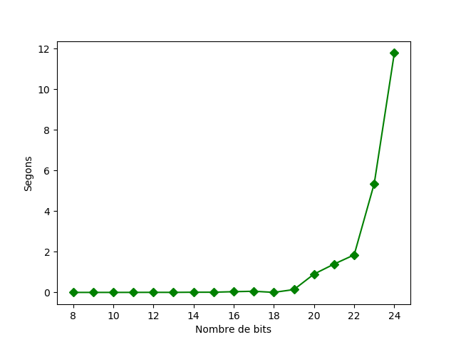

# SPD Exercici 5 Implementació d'un criptosistema RSA

**Autor:** Francesc Xavier Bullich Parra

## Introducció


RSA és un criptosistema de claus asimetrica. Tenim una clau privada que només la coneixerà el propietari i una clau publica que tothom pot coneixer.
La seguretat es basa en el secret de la clau privada. 

- La clau privada éstà formada per un numero N i per un número d, anomenat també exponent privat.
- La clau pública està formada per un número N i per un número e, anomenat també exponent públic.

Com veiem Tan la clau privada com la clau pública comparteixen un número N en comú. Es podria pensar que tenint N i e, es pot aconseguir la d que és l'únic ingredient que falta per aconseguir la clau privada (secreta). 
Aconseguir aquest número és molt dificil i aquesta es la clau de RSA. El nombre d, es pot aconseguir fent l'invers modular de e, aixó si, en Z/phi(N).

La seguretat de RSA rau en la complexitat de trobar aquest phi(N) (Euler). Sabent que N està format per 2 nombres primers molt grans  podem trobar phi(N) = phi(primer_primer)*phi(segon_primer). La funció phi(n) d'un primer n és n-1. Per tant ens quedaria que phi(N)== (primer_primer - 1)*(segon_primer - 1).

Així doncs "només" s'ha de factoritzar N per trobar els 2 primers que la formen però... Això no es gens senzill. L'algoritme per factoritzar un nombre en els seus factors primers te un cost exponencial en nombre de digits. Per tant, com que tractem amb numeros primers molt gans, aquest problema esta fora de l'abast del comput actual.

## Generació de les claus pública i privada

[Veure fitxer genera_claus.py](https://github.com/fxbp/spd-5/blob/master/genera_claus.py)
[Veure fitxer funcions.py](https://github.com/fxbp/spd-5/blob/master/funcions.py)

**Obtenció del nombres primers**

Com s'ha comentat necessitem 2 nombres primers que anomenem p i q per generar les 2 claus. Aquests nombres primers han de ser prou grans com perque al intentar facotritzar el seu producte (N, que forma pert de la clau) sigui realment difícil. Per tant el primer pas és generar aquests 2 nombres primers prou grans.

Per fer-ho s'utilitza la funció 'troba_primer(nbits)'. Aquesta funció genera un nombre aleatori de nbits (passat per paràmetre) i llavors comprova si es primer amb el test de primalitat de fermat. Si no passa el test de primalitat, es provarà incrementant en 1 el nombre fins que es trobi un nombre primer (passant el test de fermat).

Es pot veure la funció 'fermat_primalitat(n)'. El que fa aquesta funció és provar amb els 10 primers nombres primers a veure si el nombre n passat per paràmetre és divisible per algun d'ells. si no ho és llavors considerem que és primer. Aquesta funció pot fallar ja que no es comproven tots els possibles divisiors, pero la probabilitat de fallar és prou petita com perque no es tingui en compte.

Així doncs genero els 2 nombres primers amb aquestes funcions. Pel que fa al nombre de bits, utilitzo per el primer nombre 1024 bits i pel segon 1031.

Ho faig així perque una de les condicions és que no siguin nombres gaire diferents en nombre de bits, pero com a primers han d'estar prou allunyats entre ells.

Un cop tenim p i q només cal multiplicar-los entre ells per obtenir la N que forma part de la clau pública i privada.

**Trobar el valor de Euler de N**

Aquest número és necessari per trobar els exponents publics i privats. Si utilitzem aquest número es molt senzill trobar e i d.

Com s'ha comentat a la introducció necessitem trobar el valor phi(N). Com sabem que N es el producte de 2 nombres primers trobar phi(N) és tan senzill com fer (p-1)*(q-1).

**Generació de l'exponent públic**

Un cop s'ha aconseguit el valor phi(N) podem passar a trobar l'exponent públic e.

Per trobar d llavors necessitem que e sigui menor a phi(n) i coprimer amb phi(n). Per tant hem de trobar un nombre que satisfaci aquesta condició. Per trobar-lo és van generan nombres aleatoris de 1024 bits. un cop generat el nombre és comprova mitjançant l'algoritme del mcd per comprovar la seva coprimalitat amb phi(n). Si no es coprimer llavors es genera un altre nombre fins que s'en troba un que ho sigui.
Pel que fa a la restricció menor que phi(n). Utilitzant nombres de 1024 bits és fàcil veure que sempre sera menor que phi(n) ja que per trobar aquest nombre s'han utilitzat nombres de com a mínim 1024 bits per tant sempre serà major.

**Generació de l'exponent privat**

Un cop aconseguits N, phi(n) i e trobar d és relativament senzill. Només serà necessari buscar l'invers modular de e a Z/phi(N). Cal observar que aquest invers segur que existeix ja que s'ha buscat un e que fos coprimer amb phi(N).


Així doncs la clau pública será (N,e) i la clau privada (N,d).


__Nota__ : S'han aplicat algunes de les recomenacions per l'eficacacia de RSA pero no totes les comentades a clase. Per exemple no es comprova que e sigui resultat d'una suma encadenada curta.


## Utilitzant RSA per xifrar i desxifrar

Ja s'ha vist com generar les claus, passem a veure com és el funcionament de xifrat i desxifrat de RSA.

[Veure fitxer criptosistema_rsa.py](https://github.com/fxbp/spd-5/blob/master/criptosistema_rsa.py)
[Veure fitxer genera_claus.py](https://github.com/fxbp/spd-5/blob/master/genera_claus.py)
[Veure fitxer funcions.py](https://github.com/fxbp/spd-5/blob/master/funcions.py)


Primer de tot s'ha d'entendre com funciona RSA. Aquest sistema es basa en fer la potencia modular del missatge utilitzant els exponets publics i privats. Si fem la potencia amb e, obtenim un missatge xifrat. Si aquest missatge xifrat el tornem a potenciar amb d, recuperem el missatge original.

**Xifrat**

Es pot veure doncs que necessitem que el missatge es transformi primer en un número per tal que podem realitzar la potencia.

Si s'observa la funcio 'codifica' de 'criptosistema_rsa.py' es pot veure com s'obté aquest nombre des del missatge original. El que es fa és lleguir el fitxer en forma de array de bytes. Un cop tenim els bytes, aplicant la funció int.from_bytes(bytes,byteorder='big') de python podem obtenir l'enter que representa el missatge. Llavors només cal realitzar la potencia modular utilitzant el missatge en forma d'enter com a base, e com a exponent i N com a Z/N.

Finalment es guarda el nou enter que representa el missatge codificat en el fitxer '<fitxer_entrada>_xifrat.txt'

**Desxifrat**

Aquest procés és similar al de xifrat. Comencem recuperant el nombre enter que representa el missatge xifrat. Llavors només hem de realitzar la potencia modular amb: enter xifrat com a base, d com a exponent i N com a Z/N.
Després obtenim l'enter desxifrat en bytes amb la funció enter.to_bytes((enter.bit_length()+7)//8,byteorder='big') de python. Finalment si volem recuperar la cadena de text es fa: str(bytes_descodificats,'utf-8') en aquest cas la codificació era utf-8.


### Aclariments

Primer de tot cal remarcar que RSA només permet codificar missatges mes curts que la mida de N. Per tant les proves realitzades només contenen cadendes d'aqeust tipus. Si es volgués xifrar un missatge més llarg s'hauria de trobar una manera de dividir el missatge en blocs de mida fixa i codificar cada un dels blocs. A més necessitariem separar el nombres resultats amb algun caràcter per saber on acaba un número xifrat i on comença el següent.

D'altra banda existeix una técnica de padding que ajuda a protegir el sistema en missatges curts. Aquesta técnica emplena el nombre xifrat fins que arriba a una mida similar a n. Aquesta tecnica de padding no s'aplica en aquesta pràctica.

### Proves

**Important** Degut a la generació del pdf, els nombres enters que son molt grans els he hagut de separar amb 'intro'. Si es copien se'ls haurà de treure aquests caràcters 'intro' extra per obtenir el nombre correcte.

**Prova 1**

Provem el criptosistema amb un text bastant curt dins del fitxer test.txt: hola que tal

```
python .\criptosistema_rsa.py .\test.txt
S'ha codificat el missatge al fitxer: .\test.txt_xifrat.txt
S'ha descodificat el missatge xifrat a :.\test.txt_desxifrat.txt

Nombre primer p:
 76095535491781983826180305558561982807560349454909743840822
 82148644532952571170090203892821512790157035135334726392973
 15144855260452759429234487753113427143924975310257031070865
 21911214272853129722548489656729716194768298091025222491961
 34604569989453029228111821237087816925707089515586248451532
 5020672567779     
Nombre primer q: 
410840045206349840756947083531732296147105818386329589258775
479749942630479530557413387445130071044961391986436680449190
709038702960778573453884758546622810322789078109366830372546
093733427550918495404982956080266424433460959455125781966246
790010828279350358129491437455325274679481131235252737119010
7367318327   
Modul (N): 
31263093241445108996381016251498045957876876832690148855761
24517301386391085662562079618421654523540727828478109758782
25144710575831695393758461203945500251448091683681279796147
07458496449074571214428839826428554117381958774614685291598
32955025781058209442037077885012482948378744541699053009344
86000785155798338044078235735934379056387673255519071050097
64560498694678575612584250313367831414953393482646676672791
32336440799798257395558743180569270228762615068220825821753
83401675578479587238117323051539108795571272931510986683342
07489447815429630980373392148226975634970486628928726997170
3966887771306450364376385733
Exponent public (e): 
1348220700050382763390189063730281893831322251091096507273
6173713830236267148857991751934497754149206078646412443859
6497393738018007011002798032779695211955726952010179055748
5926187010099914503785177123200513125411590894948006663563
6442736952854600736865914295598729930410612633721350605613
1428253045260190187
Exponent privat (d): 
2566587197057306964743870834974988695630908702798852121894
2561952699200455440189128905244419454388209108671700923832
0530255912440059149054744020113466564374213616733747022160
7200284658824138565804406709355399382080545443530770178951
3447922147172600257630107524940921613984964037966564787699
9189662342604697136300185209456902608880066496877660456700
8600573597775120733090770745656798920155162430442766150868
3660183867481688200761720578390377204259277064388575732218
8996660281629686077712077649427549629155622471919915455982
4912860406370843567346465409974953614143040188817099876797
82771183356536202650890422651374859839
S'ha xifrat el contingut del fitxer a: .\test.txt_xifrat.txt
b'hola que tal\r\n'
S'ha desxifrat el text xifrat a: .\test.txt_desxifrat.txt
```

Podem trobar el nombre enter que representa el missatge xifrat a test_xifrat.txt

```
157922809626083609040984745595121881402253575346985179626
050541711752911072500740445859468049150467169038396015470
819263896770720051911216599889756935436338195126457257308
368073751907434550108153123794277428884898728366218618516
807094869078269898463202255179155556595481866520714067862
642377845670926352529303787818445636250982728043750087310
982752079916829772823298638700673479617539054166370950522
434781882224847684686410167197175259591710251090083440607
279990414678891908945894394016988240192908704888260832081
835054640364596132497797340027731269533485606393643639952
502637295879379786618029747622297435134398170395
```

El fitxer text_dexifrat.txt conté el missatge que s'ha desxifrat a partir del xifrat. Es pot veure el contingut a la penultima linia de l'execució.

**Prova 2**

Es prova el sistema amb un fitxer de text major. Test2.txt: A user of RSA creates and then publishes a public key based on two large prime numbers.

```
python .\criptosistema_rsa.py .\test2.txt
S'ha codificat el missatge al fitxer: .\test2.txt_xifrat.txt
S'ha descodificat el missatge xifrat a :.\test2.txt_desxifrat.txt

Nombre primer p: 
32886756799096388927118887677811130551836253329533593946556
55188394523871815127115179894466558128468853505944175860990
17653814762758185164945793399707375881851328582235021330959
15616835992201319779243014820815898010679799929858209086746
04746093322328880641060408700561067487815814041774363615348
0304947164211     
Nombre primer q: 
13938778063022997934680807238169906921468323509351105127907
26624266186912522802261842819658288165195340759736261707261
80559538354561498224266033072022427359891183659622367986194
53413272663410204668064902544942675151861058904035817578609
42807381205132407077341385904699960835776496374210731337548
0978096831459201  
Modul (N): 
45840120423521717168457006943737723042818948352042731418360
56964337602207011173533829273647647190251085491805806134255
85342391937731242845940666412828818896803745904931896391644
59399455255957830822655635512343475514036315543263189640895
28969943608834337640461085927046753300881796441983154882464
31285027787738596624193858256763480441652644070897550767788
22750982320646626759728395738336987423033946500137888231615
77367557833265792769907135075401290683983445890831162888255
60930449063183890430694205277959524670412290272174046532677
77461065254575656975845355161680599969232325928828217154760
0947615995526727758093855411
Exponent public (e): 
6798648107588492510891048794183011740340567969242430413087460
9590225073933481748568437884850926904644979200663651820177530
7982145678851153010286046925162637970458582058908844599704061
6763158260192909555105845007332564706703137293916025600183109
8189205512165664810894106502832762547484715436972865728356926
807 
Exponent privat (d): 
12256976241763259536832271952717836391971163447385224573422847
43514191095272792333136449663543817835256895814720102046105378
28250079490749310920004686180564745234744531741097014682045021
25641355629750016868451978445811442825598291090441718673979624
81009831130453164214293849515439845790821074870294658843653758
41363077974354299081545294491634958172473941194378654250367263
53733075759588739398600925225341018019599102906169429330626604
52969808846256282725477480212340835183862336875274446220521774
76576426100140419690699748307095855104796231637055291461495921
433623432883578786923238416591620573112474229809886634563943
S'ha xifrat el contingut del fitxer a: .\test2.txt_xifrat.txt
b'A user of RSA creates and then publishes a public key based on two large prime numbers.\n'
S'ha desxifrat el text xifrat a: .\test2.txt_desxifrat.txt
```

odem trobar el nombre enter que representa el missatge xifrat a test2_xifrat.txt

```
157922809626083609040984745595121881402253575346985179626050541
711752911072500740445859468049150467169038396015470819263896770
720051911216599889756935436338195126457257308368073751907434550
108153123794277428884898728366218618516807094869078269898463202
255179155556595481866520714067862642377845670926352529303787818
445636250982728043750087310982752079916829772823298638700673479
617539054166370950522434781882224847684686410167197175259591710
251090083440607279990414678891908945894394016988240192908704888
260832081835054640364596132497797340027731269533485606393643639
952502637295879379786618029747622297435134398170395
```


## Criptoanalisi del sistema

[Veure fitxer criptoanalisi.py](https://github.com/fxbp/spd-5/blob/master/criptoanalisi.py)
[Veure fitxer genera_claus.py](https://github.com/fxbp/spd-5/blob/master/genera_claus.py)
[Veure fitxer funcions.py](https://github.com/fxbp/spd-5/blob/master/funcions.py)

Com s'ha comentat la eficacia de RSA es basa en que, tot i poder coneixer N i e (ja que son públics) no es pot trobar facilment d que és la clau secreta que només te el propietari.
Per obtenir d s'ha de trobar phi(N). I per trobar aquest valor s'ha de factoritzar N en els seus 2 factors primers i a partir d'aquí trobar l'invers modular de e a Z/phi(n). La base és que l'algoritme de factoriztació és d'ordre exponencial en nombre de bits. Per tant per a valors grans de N el temps necessari fa que sigui inviable trobar d en un temps raonable.

Podem veure una prova d'aquesta exponencialitat de forma empirica, provant valors petits de N.

El fitxer 'criptoanalisi.py' construeix primer una serie de claus publiques i privades amb valors petits de N. Per a cada valor intenta factoritzar-lo per trobar p i q per finament trobar N. Aquest fitxer a més calcula el temps i mostra un gràfic que representa el temps necessari per la factorització respecte el nombre de bits.




Com es pot veure en el gràfic per a valors petits de nombre de bits, el temps ja es comença a disparar de forma exponencial.


Exemple d'execució del programa de criptoanalisi:

```
python .\criptoanalisi.py
Sha factoritzat N
Nombre p real: 163
Nombre q real: 28477
Nombre p trobat: 163
Nombre q trobat: 28477
Sha factoritzat N
Nombre p real: 157
Nombre q real: 27059
Nombre p trobat: 157
Nombre q trobat: 27059
Sha factoritzat N
Nombre p real: 251
Nombre q real: 86501
Nombre p trobat: 251
Nombre q trobat: 86501
Sha factoritzat N
Nombre p real: 1637
Nombre q real: 232259
Nombre p trobat: 1637
Nombre q trobat: 232259
Sha factoritzat N
Nombre p real: 3793
Nombre q real: 166627
Nombre p trobat: 3793
Nombre q trobat: 166627
Sha factoritzat N
Nombre p real: 3889
Nombre q real: 481093
Nombre p trobat: 3889
Nombre q trobat: 481093
Sha factoritzat N
Nombre p real: 11393
Nombre q real: 1241321
Nombre p trobat: 11393
Nombre q trobat: 1241321
Sha factoritzat N
Nombre p real: 12689
Nombre q real: 3319733
Nombre p trobat: 12689
Nombre q trobat: 3319733
Sha factoritzat N
Nombre p real: 44123
Nombre q real: 7981433
Nombre p trobat: 44123
Nombre q trobat: 7981433
Sha factoritzat N
Nombre p real: 55439
Nombre q real: 11641783
Nombre p trobat: 55439
Nombre q trobat: 11641783
Sha factoritzat N
Nombre p real: 4049
Nombre q real: 9719977
Nombre p trobat: 4049
Nombre q trobat: 9719977
Sha factoritzat N
Nombre p real: 178259
Nombre q real: 6255281
Nombre p trobat: 178259
Nombre q trobat: 6255281
Sha factoritzat N
Nombre p real: 985799
Nombre q real: 33053947
Nombre p trobat: 985799
Nombre q trobat: 33053947
Sha factoritzat N
Nombre p real: 1764541
Nombre q real: 23808923
Nombre p trobat: 1764541
Nombre q trobat: 23808923
Sha factoritzat N
Nombre p real: 2537047
Nombre q real: 213045673
Nombre p trobat: 2537047
Nombre q trobat: 213045673
Sha factoritzat N
Nombre p real: 7288727
Nombre q real: 499766083
Nombre p trobat: 7288727
Nombre q trobat: 499766083
Sha factoritzat N
Nombre p real: 15700193
Nombre q real: 360699463
Nombre p trobat: 15700193
Nombre q trobat: 360699463
```

